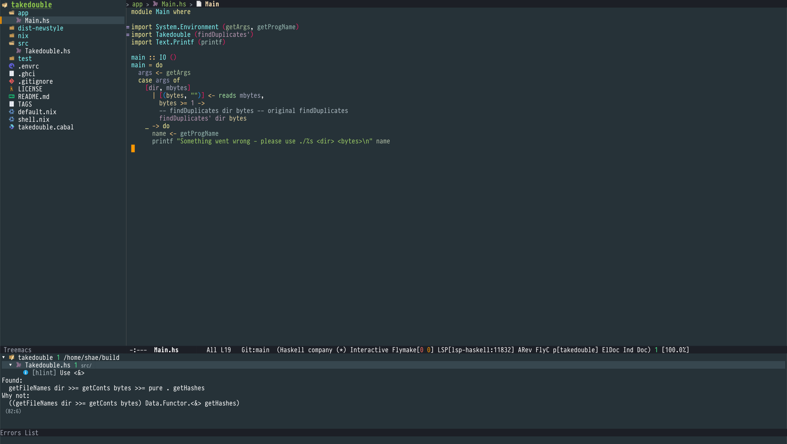

# hlsexamples
This workshop lets you practice using the haskell-language-server on a file designed to showcase the features in the 1.4 release.

# How to get started
Read the manual for [installation](https://haskell-language-server.readthedocs.io/en/latest/installation.html), or follow the instructions below.

Install [ghcup](https://www.haskell.org/ghcup/), then use ghcup to install ghc 8.10.7 and haskell-language-server 1.4

If you want to use nix, a quick way is: `nix-shell -p cookiecutter git --run 'cookiecutter gh:utdemir/hs-nix-template'` and then change directory into your generated project and `niv update nixpkgs -b nixpkgs-unstable` .
Then you'll have the latest ghc and haskell-language-server in scope.

# emacs basics
Many fun things on the [lsp-mode](https://emacs-lsp.github.io/lsp-mode/) website.

# talk contents
All the cool things in the [haskell language server features list](https://haskell-language-server.readthedocs.io/en/latest/features.html).

# attractive plumage to convince you to try this

# citations

How does all this cool stuff go?

It's the [haskell-language-server](https://github.com/haskell/haskell-language-server/) ! You too can write an amazing plugin to do whatever cool things come to mind. Check out the [existing plugins]

The case splitting magic is from [wingman](https://haskellwingman.dev/). Wingman wraps the program synthesis library [refinery](https://github.com/TOTBWF/refinery/).
